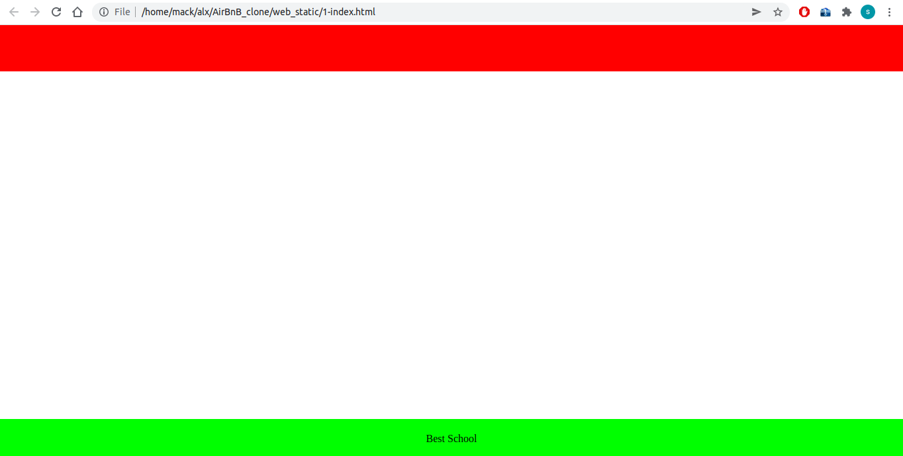

# Web - Static

## About
This is the second part of the AirBnB clone  project where the front-end part of the application is built using HTML for structure and CSS for styling. It includes simple static HTML pages, Styles, Fake contents, and No Javascript.
## File Description
 - `.html files`: These are a series of increasingly complex html pages on the web_static folder starting from 0 to 103.
 - `styles/`: CSS files for styling correspoding html pages.
 - `images/`: Images used in different parts of the html pages

## Example Usage
- Run/ double click or open one of the html files using a browser.

## Bugs
- No known bugs

## Licence
- No special licences

## Authors
 - [Stephen Makenzi Waweru - Github](/https://github.com/StephenMakenziWaweru)
 - [Linkedin](/https://www.linkedin.com/in/stephen-makenzi/)
 - [Twitter](/https://twitter.com/StephenMakenzi)

